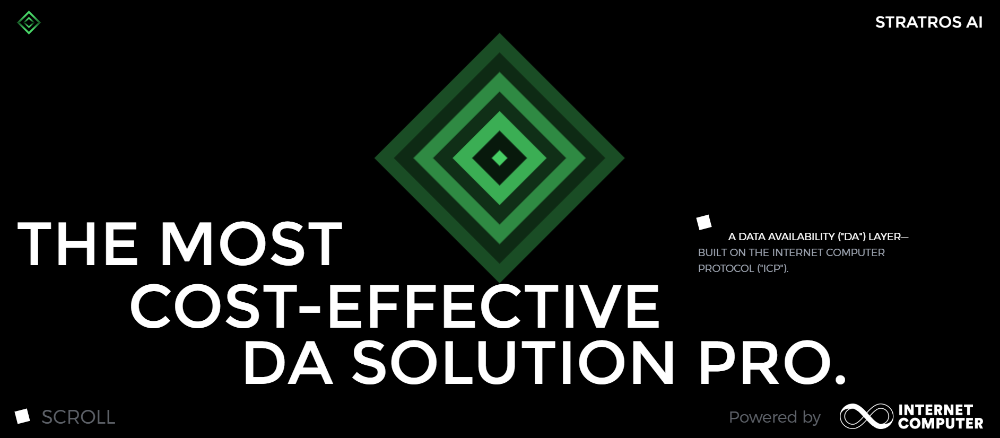

# StratrosAI

StratrosAI is a decentralized AI operating system designed to support and scale complex on-chain AI workloads, powered
by Internet Computer Protocols (ICP).

As blockchain and AI technologies rapidly evolve, the demand for decentralized AI projects has grown. StratrosAI
addresses this need by introducing an innovative restaking feature, integrating the following key components:
• A Data Availability (DA) layer.
• Decentralized storage.
• Cross-chain interoperability.

These features enable users to maximize asset utilization and yields within the ecosystem.

StratrosAI envisions a decentralized, community-driven governance model that fosters an ecosystem centered around the AI
Value System (AVS). This ensures the efficient operation and sustainable development of AI projects on-chain.
